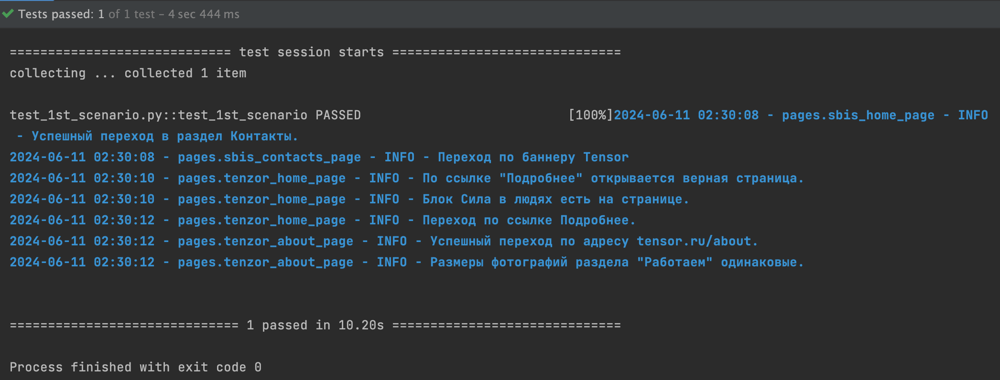
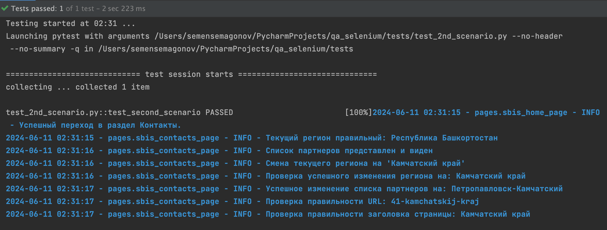

# Тестирование веб-сайта SBIS с использованием Selenium и Pytest

## Описание

Этот проект содержит тесты для веб-сайта [SBIS](https://sbis.ru/). Тесты написаны с использованием библиотеки Selenium для автоматизации браузера и Pytest для управления тестами.

Тестовые сценарии включают:

1. Проверка первого сценария
2. Проверка второго сценария
3. Проверка третьего сценария

## Требования

- Python 3.11
- Google Chrome
- Selenium
- Pytest
- ChromeDriver, совместимый с установленной версией Google Chrome
- Virtualenv (рекомендуется)

## Установка
1. **Клонируйте репозиторий:**
    ```bash
    https://github.com/samsegomof/qa_selenium.git
    cd qa_selenium
    ```

2. **Создайте виртуальное окружение и активируйте его:**
    ```bash
    python3 -m venv venv
    source venv/bin/activate  # для Linux/MacOS
    venv\Scripts\activate  # для Windows
    ```

3. **Установите зависимости:**
    ```bash
    pip install -r requirements.txt
    ```

4. Для установки Chromedriver я использовал `chromedriver_autoinstaller`.

## Запуск тестов
### Внимание!

- Запускайте тесты в выключенным VPN.

### Первый сценарий

1. **Описание:**
   - Перейти на [SBIS](https://sbis.ru/) и выполнить действия согласно первому сценарию.

2. **Запуск теста:**
    ```bash
    pytest tests/test_1st_scenario.py
    ```

### Второй сценарий

1. **Описание:**
   - Перейти на [SBIS](https://sbis.ru/) и выполнить действия согласно второму сценарию.

2. **Запуск теста:**
    ```bash
    pytest tests/test_2nd_scenario.py
    ```

### Третий сценарий

1. **Описание:**
   - Перейти на [SBIS](https://sbis.ru/) и выполнить действия согласно третьему сценарию.

2. **Запуск теста:**
    ```bash
    pytest tests/test_3rd_scenario.py
    ```
### Третий сценарий

1. **Описание:**
   - Перейти на [SBIS](https://sbis.ru/) и выполнить действия согласно третьему сценарию.

2. **Запуск теста:**
    ```bash
    pytest tests/test_3rd_scenario.py
    ```

## Результаты тестов




